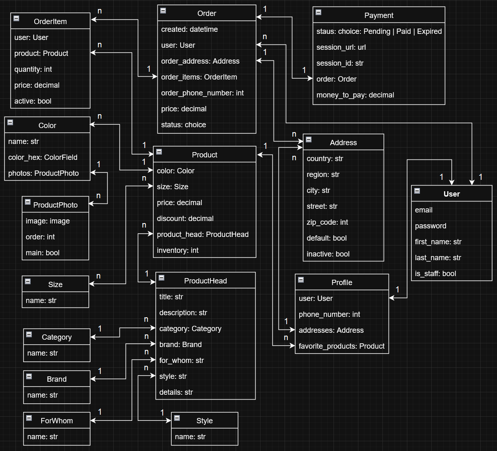

# lux-clothing-portal

Lux Clothing Portal provide a management system for selling clothing product. 
This API can be used to add: clothing products to portal, its characteristics, photos, price, discount and amount.
Users can: register, add own addresses, phone number and make orders with payments. Staff of the portal can manage orders.

## Table of Contents

- [Features](#features)
- [Database structure](#Database-structure)
- [Installation](#installation)
- [Run with Docker](#Run-with-Docker)

## Features:

- User registration and login with email
- Manage products and orders
- Token authentication support
- Project structure optimized for selling clothing
- Defined clothing characteristics: brand, category, size, color and photo
- Products can be added to cart or favorites before make order
- Allow users to make payments for orders and use different addresses
- Managing orders for portal staff
- Support payment session status tracking and renew payment session
- Provide payment session URLs and IDs for processing
- API documentation

## Database structure



## Installation

1. Clone the repository:
   ```
   git clone https://github.com/V-Shkrobatskyi/lux-clothing-portal.git
   cd lux-clothing-portal
   python -m venv venv
   venv\Scripts\activate (on Windows)
   source venv/bin/activate (on macOS)
   pip install -r requirements.txt
   ```
2. Copy .env_sample -> env. and populate with required data:
   ```
    POSTGRES_HOST=POSTGRES_HOST
    POSTGRES_PORT=POSTGRES_PORT
    POSTGRES_NAME=POSTGRES_NAME
    POSTGRES_USER=POSTGRES_USER
    POSTGRES_PASSWORD=POSTGRES_PASSWORD
    PGDATA=/var/lib/postgresql/data
    
    SECRET_KEY=SECRET_KEY
    
    CELERY_BROKER_URL=CELERY_BROKER_URL
    CELERY_RESULT_BACKEND=CELERY_RESULT_BACKEND
    
    STRIPE_SECRET_KEY=STRIPE_SECRET_KEY
   ```

3. Run database migrations and start server:
    ```
    python manage.py makemigrations
    python manage.py migrate
    python manage.py runserver
    ```

4. For load test data to database run:
    ```
    python manage.py loaddata test_project_data.json
    ```
In test data: 
- admin account: admin@admin.com/admin.1234
- user account: test@test.com/test.1234

## Run with Docker

Docker should be installed.

1. Pull docker container:
   ```
   docker pull vitaliitestaccount/lux-clothing-portal
   ```
2. Run docker container
   ```
    docker-compose build
    docker-compose up
   ```
